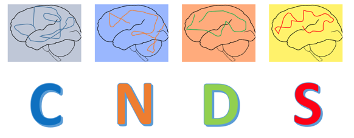

## Welcome to SASQUATCH

aka **S**hort **A**ttention **S**pan **Q**uantitative stuff yo**U** **A**dmire **T**hat **C**an **H**elp the rest of us

### Description
SASQUATCH is hosted by the [Oathes Lab](https://www.med.upenn.edu/oatheslab/) and [CNDS](https://www.med.upenn.edu/cnds/) at UPenn in the Richards Research Building, Room C301. The meeting is often held on the *third wednesday of each month* and focused on implementation, not theory or background. It involves demos and discussion, with relevant code and slides posted here on the GitHub repo. 

If you don't have access yet, request it by sending your GitHub username to Dr. Desmond Oathes with a request for [SASQUATCH](https://github.com/djo155/SASQUATCH) or [babySASQUATCH](https://github.com/djo155/babySASQUATCH) access. 



Whenever you commit to this repository, GitHub Pages will run [Jekyll](https://jekyllrb.com/) to rebuild the pages in your site, from the content in your Markdown files.

## How to Upload Your Meeting Slides and Code
If this is your first time using Github, try following this 5 minute [tutorial](https://guides.github.com/activities/hello-world/) using your new account. It will explain some new words and provide context for uploading.

### Uploading:
1. Create a new folder and README
    - Click "Create new file" > in the "Name your file..." text field enter name of new folder ending it with "/" > a new text field will pop up and name that README.md 
    - Within "Edit new file" window, add some information about the files you are about to contribute. You will be able to edit this later too. Review formatting tips below to add links, images, or headers.
    - Commit new file directly to master branch, including helpful name and brief description (optional, default is fine)
2. Prepare your code if needed by making it plain text (e.g. format drop down in Mac Text Edit or Windows Wordpad) 
3. Within your new folder, choose "Upload Files" then drag and drop as needed
4. Commit changes directly to master branch
  - Insert helpful name (e.g. "initial upload, YourTopic MeetingDate") and a brief description for this commmit 

This can all be accomplished via the command line interface for git and github. There are various resources on the web [example](https://product.hubspot.com/blog/git-and-github-tutorial-for-beginners).

_________________________________________________________________________________________________________

## Formatting Tips for README.md files
When uploading your meeting slides and code, please generate a new folder and include a README.md file. This will automatically provide a high-level overview of you meeting contents for users and should function like a brief documentation page. 

To format it, see these tips:
### Markdown

Markdown is a lightweight and easy-to-use syntax for styling your writing. It includes conventions for

```markdown
Syntax highlighted code block

# Header 1
## Header 2
### Header 3

- Bulleted
- List

1. Numbered
2. List

**Bold** and _Italic_ and `Code` text

[Link](url) and 
```

For more details see [GitHub Flavored Markdown](https://guides.github.com/features/mastering-markdown/).

### Jekyll Themes

Your Pages site will use the layout and styles from the Jekyll theme you have selected in your [repository settings](https://github.com/djo155/babySASQUATCH/settings). The name of this theme is saved in the Jekyll `_config.yml` configuration file.

### Support or Contact

Having trouble with Pages? Check out our [documentation](https://help.github.com/categories/github-pages-basics/) or [contact support](https://github.com/contact) and we’ll help you sort it out.
